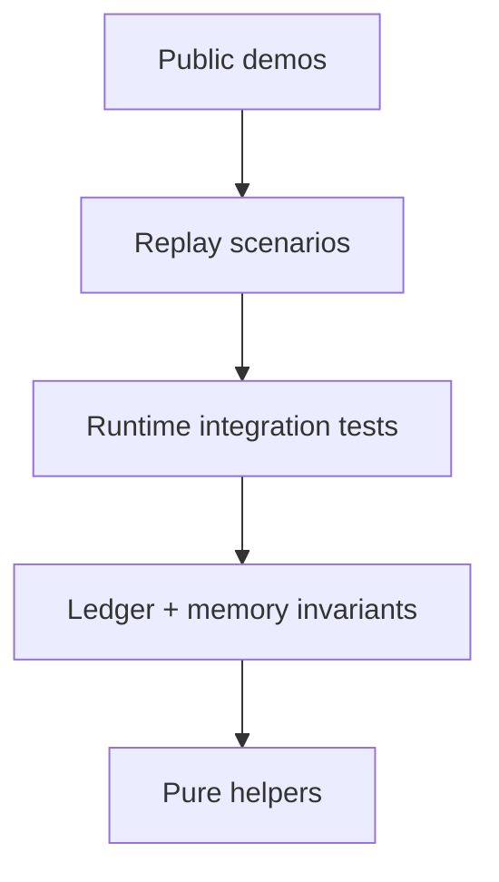

# Benchmarks

ShovsOS uses small deterministic benchmark scenarios first. These tests do not require live LLM calls or network access. They check whether the runtime preserves state, links evidence, and blocks common failure modes.

## Run The Core Benchmarks

```bash
venv/bin/python -m pytest \
  tests/test_agent_harness_core_benchmarks.py \
  tests/test_response_guard.py \
  tests/test_runtime_e2e_diagnostics.py \
  tests/test_shovs_memory.py \
  tests/test_run_ledger.py \
  tests/test_trace_replay_api.py -q
```

## Run From The UI

Open Shovs Platform and select the **Harness** workspace tab.

The tab calls:

- frontend path: `GET /api/harness-lab/catalog`
- frontend path: `POST /api/harness-lab/benchmark/run`
- backend direct path: `GET /harness-lab/catalog`
- backend direct path: `POST /harness-lab/benchmark/run`

The benchmark is deterministic. It does not call a live LLM and does not use the network.

## Benchmark Pyramid



The bottom layers should be fast and deterministic. Public demos should be built only after the lower layers pass.

## Current Core Scenarios

| Scenario | What it proves | Primary tests |
| --- | --- | --- |
| Source collection contract | The agent keeps selected entities locked and fetches the requested sources instead of drifting. | `tests/test_runtime_e2e_diagnostics.py`, `tests/test_agent_harness_core_benchmarks.py` |
| Tool hallucination guard | Final responses cannot pass tool-call-shaped JSON as user-facing text. | `tests/test_response_guard.py` |
| Ledger linking | Tool results cannot exist without a known tool call. | `tests/test_run_ledger.py`, `tests/test_agent_harness_core_benchmarks.py` |
| Memory rollback | Replacing facts does not destroy the old fact if the new fact fails to store. | `tests/test_shovs_memory.py` |
| Trace replay | Stored traces can be read as workflow state, not only raw logs. | `tests/test_trace_replay_api.py` |
| Harness Lab API | The UI can load wedge metadata and run deterministic benchmark results. | `tests/test_harness_lab_api.py` |

## What A Good Benchmark Must Include

- A user objective.
- The expected scenario state.
- The allowed tools.
- The required evidence.
- The forbidden drift.
- A machine-readable pass/fail result.
- A readable explanation for humans.

## What We Do Not Count As Proof

- A single good-looking final answer.
- A trace that cannot be replayed.
- A demo that depends on one lucky model output.
- A prompt-only solution without runtime checks.
