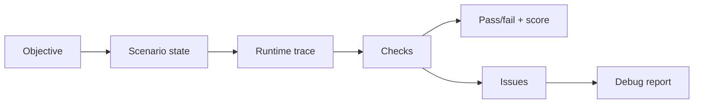

# Evaluation Design

The evals in this repo are based on scenario state. The final answer is not trusted by itself.

The runtime asks: did the agent actually do the work that the user requested?

## Evaluation Loop



## Source Collection Eval

This catches a common agent failure:

1. The agent identifies the correct entities.
2. Later searches drift to unrelated entities.
3. The final answer looks plausible anyway.

The eval checks the trace against locked scenario state:

- expected entities
- expected search queries
- expected fetch count
- forbidden query terms
- allowed URLs
- source-contract events

## Tool Honesty Eval

The ledger requires every tool result to reference a known tool call.

This blocks a whole class of failures where the model says a tool ran, but the runtime has no successful result.

## Memory Eval

Memory is evaluated as state, not prose.

The important checks are:

- current facts remain current
- superseded facts are visible as history
- disputed facts are surfaced
- failed replacements roll back
- the inspector reports the real graph path

## Response Guard Eval

Small and local models can output tool JSON as if it were a final answer.

The response guard checks final text for:

- raw tool-call JSON
- hidden runtime terms
- empty output after cleanup

It returns clean user-facing text and records what changed.

## Machine-Readable Result Shape

```json
{
  "suite": "agent_harness_core",
  "scenario": "source_collection_contract",
  "passed": true,
  "score": 1.0,
  "checks": ["targeted_searches", "fetch_quota", "no_drift"],
  "issues": [],
  "evidence": {
    "entities": ["ROKU", "TBN", "SENEA"],
    "required_urls": 9
  }
}
```

