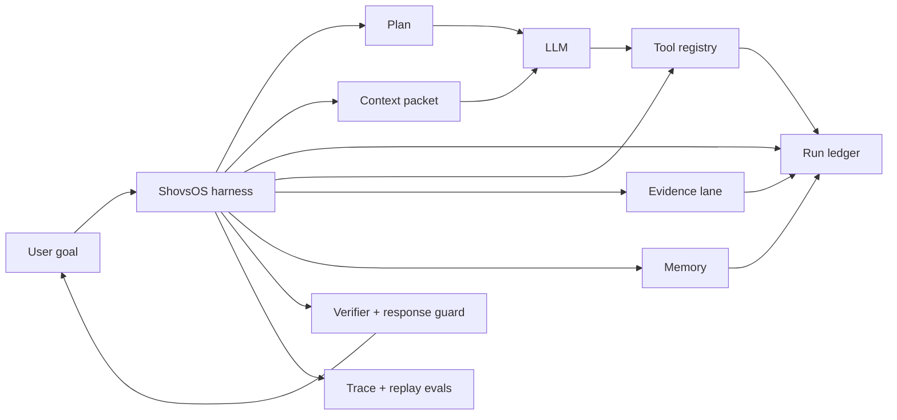
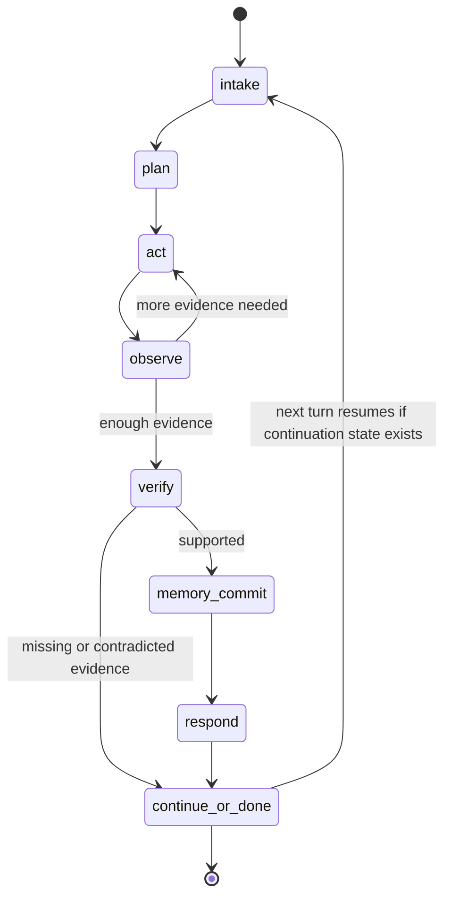

# ShovsOS Agent Harness

ShovsOS is a research agent harness. That means it sits around a language model and experiments with controlling the work the model is allowed to do.

It does not try to make the model smarter by adding longer prompts. It gives the model a smaller, clearer job at each step, then checks the work with structured state.

## What The Harness Does

- Keeps a typed run ledger for the current task.
- Builds phase packets from that ledger instead of passing loose prompt text around.
- Links every tool result to a real tool call.
- Turns web and tool output into evidence before final response generation.
- Stops final answers from claiming tool work that is not in the ledger.
- Stores memory with provenance and rollback behavior.
- Produces traces that can be replayed by tests and inspected by the UI.

## What It Is Not

- It is not a new foundation model.
- It is not a generic chat wrapper.
- It is not a benchmark claim without local tests.
- It is not a promise that every model will follow every instruction.

The practical claim is narrower: local tests show the harness can catch several common agent failures in controlled scenarios before they become user-visible output.

## Core Runtime Shape

Each state has expected inputs and allowed outputs. In the current implementation, acting and observation can loop within a run. Final verification can recommend replanning and persist continuation state for the next turn; it does not yet automatically re-enter the acting loop after the final response.

## Why This Matters

Most agent failures look reasonable in the final answer. The trace is where the failure appears:

- The model planned to search one thing but searched another.
- A tool failed but the answer implied success.
- A later step forgot entities selected earlier.
- Memory stored a stale fact as current truth.
- Raw tool JSON leaked into chat.

ShovsOS treats those as runtime problems, not just prompt problems.
