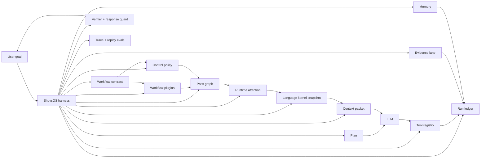
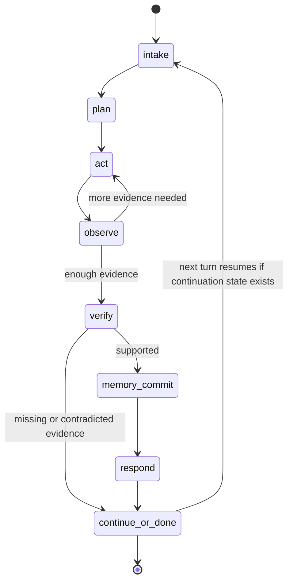

# ShovsOS Agent Harness

ShovsOS is a research agent harness. That means it sits around a language model and experiments with controlling the work the model is allowed to do.

It does not try to make the model smarter by adding longer prompts. It gives the model a smaller, clearer job at each step, then checks the work with structured state.



## What The Harness Does

- Keeps a typed run ledger for the current task.
- Converts recognizable task shapes into workflow contracts with completion gates.
- Routes domain-specific workflow behavior through registered workflow plugins instead of hardcoded engine branches.
- Selects a control policy per run: ReAct, plan-act-observe, plan-then-execute, or structured graph harness.
- Maps workflow contracts to specialist pass graphs with explicit roles and stop conditions.
- Scores ledger records by phase so context is weighted before the model sees it.
- Composes a language-kernel snapshot: prompt contract, context ladder, tool gate, memory immune report, experience graph, proxy-state eval, micro-agent jobs, and UI run map.
- Builds phase packets from that ledger instead of passing loose prompt text around.
- Validates plan-execute tool calls against locked entities, source contracts, and next required actions.
- Blocks or replaces invalid calls in `ledger_enforced` mode while recording violations in `shadow` mode.
- Uses a context ladder so the model sees compact signals first and raw payloads only by reference unless needed.
- Links every tool result to a real tool call.
- Turns web and tool output into evidence before final response generation.
- Stops final answers from claiming tool work that is not in the ledger.
- Stores memory with provenance and rollback behavior.
- Produces traces that can be replayed by tests and inspected by the UI.

## Smallest Live Harness

The smallest standalone version lives in
[`extractions/shovs-harness-core`](extractions/shovs-harness-core). Use it when
you want to test the core idea without the full ShovsOS app:

```bash
venv/bin/python extractions/shovs-harness-core/scripts/check_setup.py
extractions/shovs-harness-core/scripts/run_live_app.sh
```

It runs a local JSON backend on `127.0.0.1:8091` and a Vite frontend on
`127.0.0.1:5177`. The backend exposes the extracted extension contract and can
probe a local llama.cpp server when `LLAMACPP_BASE_URL` is set.

For local llama.cpp tests, prefer `llama-server --host 127.0.0.1 --port 8081`.
If `brew install llama.cpp` fails with `/opt/homebrew is not writable`, fix the
Homebrew prefix ownership or build llama.cpp from source; do not run
`sudo brew install`.

## What It Is Not

- It is not a new foundation model.
- It is not a generic chat wrapper.
- It is not a benchmark claim without local tests.
- It is not a promise that every model will follow every instruction.

The practical claim is narrower: local tests show the harness can catch several common agent failures in controlled scenarios before they become user-visible output.

## Core Runtime Shape



Each state has expected inputs and allowed outputs. In the current implementation, acting and observation can loop within a run. Final verification can recommend replanning and persist continuation state for the next turn; it does not yet automatically re-enter the acting loop after the final response.

## Control Policies

The loop is now an explicit policy, not a hidden assumption.

Supported policies:

- `react`: reason-act-observe. Useful for bounded low-risk tasks and quick tool iteration.
- `plan_observe`: the compatibility policy. Planner narrows tools, actor performs one action, observer decides whether to continue.
- `plan_execute`: safer default for web/source workflows. The plan is committed before untrusted web content is read; observations fill slots but should not redefine the task.
- `graph_harness`: structured pass graph with bounded recovery. Better for coding, high-risk, or long-horizon workflows.

`auto` chooses a policy from the workflow contract, risk policy, and tool set. Source collection and time-sensitive web tasks prefer `plan_execute`; coding and high-risk tasks prefer `graph_harness`; simple chat can use `react`.

`LEDGER_MODE=shadow` records violations without changing legacy behavior. `LEDGER_MODE=ledger_enforced` turns the ledger into a runtime gate: wrong next tools, unlocked-entity searches, off-contract fetches, and incomplete source coverage are blocked or redirected before the response is treated as complete.

## Why This Matters

Most agent failures look reasonable in the final answer. The trace is where the failure appears:

- The model planned to search one thing but searched another.
- A tool failed but the answer implied success.
- A later step forgot entities selected earlier.
- Memory stored a stale fact as current truth.
- Raw tool JSON leaked into chat.

ShovsOS treats those as runtime problems, not just prompt problems.

## Workflow Plugins

The engine should stay topic-agnostic. Domain behavior belongs in workflow plugins.

Current plugins:

- `stock_movers_source_collection`: detects requests like "top 3 stocks, search each, fetch 3 URLs each", fetches a market-movers source, locks ticker entities, enforces separate ticker searches, then requires the fetched source quota before final response.
- `local_place_source_collection`: locks local places from discovery search results, then requires separate per-place searches and fetched evidence.
- `comparison_source_collection`: locks compared products/items/options, gathers per-entity sources, and supports evidence-backed comparison tables.

Plugin shape:

```text
detect objective
  -> infer source contract
  -> extract or lock entities from tool evidence
  -> choose next tool
  -> return missing slots, argument clues, and completion state
```

The engine calls the plugin registry through `select_workflow_override(...)`. It does not need stock-specific source rules in the loop.

## Deterministic Source Tool

`source_collect` is the compact tool surface over the source workflow primitives.
It does not replace `web_search` or `web_fetch`. It compiles the current source
state into one inspectable object:

- inferred source contract
- locked and rejected entities
- selected URLs grouped by entity
- fetched URL coverage
- missing slots
- exact next action
- final-answer gate

This gives smaller models a stable path through multi-source tasks. Instead of
remembering to call `source_contract`, then `source_select`, then `source_coverage`,
then choosing the next fetch manually, the model can ask the harness what source
step is allowed next. Managed runs still prefer ledger-backed tool result IDs over
model-supplied payloads, so the tool cannot be used to launder fabricated search
results into evidence.

## Search Query Boundary

The full user request is not the search query.

Source-collection turns often contain several different kinds of information:

- the objective: "top 3 stocks today"
- workflow instructions: "search each separately"
- source quotas: "capture 3 results each"
- tool steps: "fetch all 9 URLs"
- output format: "write a TLDR table"

Those belong in the ledger, workflow contract, and completion gate. The
`web_search.query` field should contain only the retrieval probe. The runtime
therefore compiles workflow-like search text before execution. For example:

```text
Search top 3 stocks today with major jumps web search those 3 stocks separately
and capture 3 relevant results for each, web fetch all 9 URLs, write a TLDR table
```

becomes:

```text
top 3 stocks today with major jumps
```

The original objective is still preserved in trace and planning state. The
search engine just receives the smaller query it can actually answer.

## Context Ladder

The actor should not receive every memory block, trace payload, and raw tool result by default. ShovsOS now represents context as a ladder:

```text
keyword hint
  -> compact memory signal
  -> relevant block
  -> evidence reference
  -> raw payload on demand
```

Phase packets include this ladder as structured runtime context. Raw payloads stay available for trace inspection and verification, but the model gets the smallest useful view first.

Simple chat uses a sparse packet. Short greetings and acknowledgements do not
receive stale plans, runtime attention, historical transcript, compressed memory,
or source workflow state. This prevents old cognitive context from bleeding into
turns like "hi again" while preserving full packets for source, coding, memory,
and research workflows.

When the optional BGE reranker is unavailable, session retrieval now falls back to
a deterministic lexical reranker. Exact entity and query-term matches are promoted
over generic vector hits, which keeps locked entities and current objectives more
stable on lightweight installs.

`coherence_eval` provides a small regression surface for intent routing and packet
leak checks. It is not a benchmark claim; it is a guardrail for failures where the
final answer sounds normal but the runtime used the wrong workflow or injected the
wrong context.

Compression also has a low-value-turn gate. Greetings and acknowledgements such
as "hi again", "thanks that helps", and "ok got it" are not written into durable
or convergent memory, even when the assistant response is verbose. Existing
serialized context is preserved on those turns, so a trivial acknowledgement
cannot wipe V2/V3 memory state.

Frontend/API chat also uses deferred memory maintenance by default. The response
stream can finish before compression and vector indexing complete, while direct
`RunEngine` calls still default to synchronous commits for deterministic tests.
Set `SHOVSOS_MEMORY_COMMIT_MODE=sync` to force old blocking behavior, `async` to
respond first and commit in the background, or `skip` for no memory maintenance
on a run.

LLM compression is also adaptive. Deterministic memory governance can run every
turn, but the expensive `compress_exchange` model call now runs only when a turn
has durable memory signals, corrections, deterministic fact updates, candidate
stance signals, or a periodic maintenance interval. Configure this with
`SHOVSOS_LLM_COMPRESSION_MODE=adaptive|always|off` and
`SHOVSOS_LLM_COMPRESSION_INTERVAL` (default `6`). This keeps ordinary Q&A turns
from paying an extra model call just to rewrite context.

## Language Kernel Snapshot

`run_engine/language_kernel.py` is the compact runtime object for the next
ShovsOS direction. It does not call a model. It gathers the seven reliability
lanes into one typed snapshot that prompts, tests, traces, and UI can consume.

The snapshot contains:

- `prompt_contract`: the current role, policy, locked entities, allowed next tool, missing slots, successful result IDs, and short runtime rules.
- `context_ladder`: compact memory and evidence first, raw payloads by reference unless explicitly requested.
- `attention`: phase-weighted ledger items from runtime attention.
- `tool_gate`: next required action, source contract, completion gate, and policy violations.
- `memory_immune_report`: memory writes, provenance status, disputed writes, and conflict traces.
- `experience_graph`: objective, plan, tool calls, tool results, and evidence as reusable trajectory nodes.
- `proxy_state_eval`: state-based checks for missing evidence, unsupported tool claims, drift, and completion.
- `micro_agent_jobs`: small bounded jobs suitable for cheap verifier/classifier/compressor models.
- `ui_run_map`: simple sections a frontend can render as Objective -> Plan -> Tools -> Evidence -> Memory -> Verification -> Response.

The important design choice is that this layer is deterministic. Provider-native
tool calling is treated as a transport detail; the language kernel decides what
state the model is allowed to see and what the runtime must verify.

Tool selection now uses this layer actively. If the ledger has an exact
`next_required_action` with complete arguments, the runtime can select that tool
without another actor-model call. If the next action is not deterministic, the
actor prompt receives the language-kernel contract above the older context. That
keeps provider-native tool calling useful while preventing it from becoming the
source of truth.

Example actor contract:

```text
Runtime Prompt Contract:
- role: actor
- phase: acting
- objective: Search top 3 stocks, search each separately, fetch 3 URLs each
- policy: plan_execute
- final answer allowed: false
- allowed next tool: web_search
- allowed arguments: {'query': 'ROKU stock news June 13 2026'}
- locked entities: ROKU, TBN, SENEA
- missing slots: fetched_urls:0/9
Rules:
- Do not claim a tool ran unless its successful result id is listed.
- Use the allowed next tool when one is provided.
- Do not search or fetch outside locked entities/source contracts.
- Do not write memory unless provenance or evidence is available.
- Do not produce a final answer while missing slots remain.
```

This is the practical form of the research thesis: use language for intent and
judgment, but let the harness own state, tools, memory, continuation, and proof.

## Turn Relation Calculus

Context is not retrieved by similarity alone. Each turn is first classified by
its relationship to prior context:

- `fresh_topic`: isolate from old plans and locked entities.
- `direct_continuation`: load continuation state, pending steps, and next required action.
- `distant_resumption`: retrieve compact memory signals and raw refs, not full history.
- `correction`: latest explicit correction dominates older conflicting facts.
- `refinement`: patch the current plan or constraint without restarting everything.
- `deviation`: preserve stable preferences, but replan workflow state.
- `meta_instruction`: apply as runtime/style policy, not domain factual content.

The classifier emits a proof packet:

```text
relation
confidence
anchors
required_context
blocked_context
memory_write_policy
tool_policy
proof_obligations
```

That packet is stored on the run ledger and rendered inside the language-kernel
prompt contract. A real model sees a compact directive such as:

```text
- turn relation: direct_continuation
- relation required context: continuation_state, locked_entities, next_required_action
- relation blocked context: unrelated_memory, old_completed_plans
```

This gives the harness a logical reason for context inclusion. It can prove why
old state was used, ignored, patched, or demoted.

## Provider Capability Matrix

`llm/provider_capabilities.py` describes provider/model features as runtime
flags:

- native tool transport
- structured JSON support
- vision input support
- image generation support
- reasoning-control support
- parallel tool support
- explicit tool-choice support
- fallback protocol

The engine should not assume every model behaves the same. Native tools are
preferred when available, but unknown providers fall back to the same internal
`ToolCallDraft`/JSON protocol. The business logic stays in the harness; provider
features only choose the safest transport.

## Harness Lab

Harness Lab exposes deterministic comparisons between runtime modes:

- plain model
- model plus tools
- ShovsOS ReAct
- ShovsOS Plan-Execute
- ShovsOS Graph Harness

The point is not to show prettier answers. It shows the execution path: policy selected, tool trace, entity drift, source-contract coverage, completion gate status, and state-eval score.

Harness Lab now reports two deterministic eval layers:

- source collection eval: did the run preserve entities, exact searches, and fetch quotas?
- policy trace eval: did the trace prove the selected policy, ledger mode, recovery behavior, and completion gate?

## Workflow Lab

Workflow Lab is the platform-facing surface over the harness. It treats workflows as typed runtime contracts, not loose prompt blobs.

Current workflow definitions:

- `research_brief_v1`
- `shopping_comparison_v1`
- `local_recommendation_v1`
- `memory_fact_guard_v1`
- `coding_patch_eval_v1`

Each definition exposes:

- input schema
- output schema
- policy and ledger mode
- prompt version
- allowed tools
- memory policy
- step timeline
- gates and produced artifacts

External apps can start and inspect deterministic workflow runs through:

```text
GET  /workflow-lab/catalog
POST /workflow-lab/workflows/{workflow_id}/runs
GET  /workflow-lab/runs/{run_id}
GET  /workflow-lab/runs/{run_id}/events
GET  /workflow-lab/runs/{run_id}/result
```

This layer is deliberately small but now runtime-backed. Workflow runs are stored in SQLite, expose status/events/result endpoints, and support two run modes:

- `deterministic_contract`: fast local contract proof with no live model call
- `live_run_engine`: asynchronous execution through `RunEngine.stream(...)`, persisted under the same workflow run envelope

It proves that ShovsOS features can be composed as workflows with visible status, events, memory policy, trace semantics, and expected result shape. It is still not a full production automation service: auth, API keys, webhooks, multi-worker queues, and persistent user-authored workflow editing are still future work.

## Graph Harness State

`graph_harness` now carries deterministic pass-node state in the run ledger. A pass graph is initialized from the workflow contract, each node has a status (`pending`, `running`, `completed`, `failed`, or `blocked`), dependencies are explicit, and graph execution is emitted as trace events.

Trace Monitor and run replay expose Policy, Graph, and Recovery lanes so the UI can show the harness path without parsing raw JSON.
