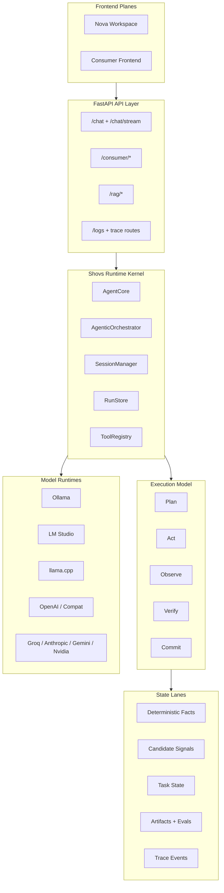

# Shovs LLM OS

Shovs LLM OS is a local-first, open-source Language OS for building and running stateful AI systems with explicit execution control.

It is not just a chatbot shell or a prompt wrapper. It is a runtime with:
- phase-aware context compilation
- run identity and checkpoints
- single-loop and managed-loop execution
- tools, memory, traces, artifacts, and evals
- local and cloud model adapters
- Nova and consumer planes on top of the same kernel
- agent-builder controls for composing stronger agents without changing the kernel


## What This Project Is

Shovs treats language as the interface, not the entire runtime state.

The core idea is:
- parse language into structured runtime state
- run explicit phases over that state
- ground actions in tool results and verified evidence
- compile only the context needed for the current phase
- serialize back into language only when the model actually needs it

That is the basis of the "Language OS" claim.

Read the public vision document: [documentation/public/VISION.md](/Users/theshovonsaha/Developer/Github/agent/documentation/public/VISION.md)

## Current Runtime Model

The backend supports two execution modes:

- `single`
  - direct actor loop
  - lower overhead
  - good for small local models and simple tasks

- `managed`
  - explicit `plan -> act -> observe -> verify -> commit`
  - still inside one run, not a swarm by default
  - better for complex multi-step work

- `auto`
  - resolves between the two based on runtime conditions
  - local OpenAI-compatible runners prefer `single` by default

Each turn can produce:
- a first-class `run`
- phase traces
- loop checkpoints
- tool results
- run artifacts
- run evals

## What Is Implemented

### Runtime Kernel
- phase-aware context compilation
- managed and single loop control
- run identity with `run_id` and optional parent runs
- persisted loop checkpoints
- prompt minimization and context-overflow retry
- model-aware execution profiles and prompt budgets for small local, local standard, and frontier-class models

### State Integrity
- verified facts are separated from candidate signals
- assistant guesses are blocked from hardening into deterministic truth
- failed turns are preserved for recovery
- task bootstrap is guarded so `todo_write` does not repeat endlessly in the same run
- post-tool follow-up context is sanitized to reduce bloat

### Memory and Retrieval
- semantic graph memory
- vector memory
- session RAG
- task tracker
- runtime embed-model propagation into memory tools
- provider-aware embedding transport for Ollama, LM Studio, llama.cpp, and OpenAI-compatible runners
- context-engine variants:
  - V1 linear durable memory
  - V2 convergent context
  - V3 hybrid

### Tooling
- web search and fetch
- file create/view/replace
- bash execution
- RAG search
- task tools
- memory tools
- delegation hooks
- MCP integration path

### Providers
- Ollama
- LM Studio
- llama.cpp
- local OpenAI-compatible servers
- OpenAI
- Groq
- Anthropic
- Gemini
- Nvidia

### Frontends
- `frontend_nova`
  - operator workspace
  - mobile-friendly navigation and monitor
  - loop controls
  - reasoning visibility
  - agent builder with presets, bootstrap docs, and prompt contribution summary

- `frontend_consumer`
  - consumer-facing plane

## Architecture



## Repository Map

- `/engine`
  - runtime kernel, context compiler, fact guard, loop logic
- `/orchestration`
  - agent manager, profiles, run store, session management
- `/memory`
  - semantic graph, vector search, session RAG, task tracking
- `/plugins`
  - tool registry and concrete tools
- `/llm`
  - provider adapters and adapter factory
- `/api`
  - FastAPI routes and stream entrypoints
- `/frontend_nova`
  - primary operator UI and agent builder
- `/frontend_consumer`
  - consumer plane
- `/documentation/public`
  - public OSS docs

## Quick Start

### Prerequisites

- Python 3.10+
- Node.js 18+
- npm 9+
- optional: Docker
- optional: a local model runner such as Ollama, LM Studio, or llama.cpp

### Install

```bash
git clone https://github.com/theshovonsaha/shovsOS.git
cd shovsOS

python3 -m venv venv
source venv/bin/activate
pip install -r requirements.txt

npm install
cd frontend_nova && npm install && cd ..
```

Optional consumer frontend setup:

```bash
cd frontend_consumer && npm install && cd ..
```

### Configure

```bash
cp .env.example .env
```

Pick one provider path:

- `LLM_PROVIDER=ollama`
- `LLM_PROVIDER=lmstudio`
- `LLM_PROVIDER=llamacpp`
- `LLM_PROVIDER=local_openai`
- `LLM_PROVIDER=openai`
- `LLM_PROVIDER=groq`

Examples:

```env
LLM_PROVIDER=lmstudio
LMSTUDIO_BASE_URL=http://127.0.0.1:1234/v1
LMSTUDIO_API_KEY=lm-studio
DEFAULT_MODEL=qwen2.5-coder-3b-instruct-mlx
```

```env
LLM_PROVIDER=ollama
OLLAMA_BASE_URL=http://localhost:11434
DEFAULT_MODEL=llama3.2
EMBED_MODEL=ollama:nomic-embed-text
```

### Run Nova

```bash
npm run dev:nova
```

Key URLs:
- Nova: [http://localhost:5174](http://localhost:5174) or the Vite port shown in terminal
- Backend API: [http://localhost:8000](http://localhost:8000)
- API docs: [http://localhost:8000/docs](http://localhost:8000/docs)

### Run Consumer

```bash
npm run dev:consumer
```

## Recommended Local Setups

### LM Studio

Use when you want a strong local OpenAI-compatible server on macOS, especially on Apple Silicon.

```env
LLM_PROVIDER=lmstudio
LMSTUDIO_BASE_URL=http://127.0.0.1:1234/v1
LMSTUDIO_API_KEY=lm-studio
```

### Ollama

Use when you want a very simple local path.

```env
LLM_PROVIDER=ollama
OLLAMA_BASE_URL=http://localhost:11434
```

### llama.cpp

Use when you want a lightweight local OpenAI-compatible runner.

```env
LLM_PROVIDER=llamacpp
LLAMACPP_BASE_URL=http://127.0.0.1:8080/v1
LLAMACPP_API_KEY=llama.cpp
```

## Why Small Models Matter Here

One of the design goals of Shovs LLM OS is to make small local models more coherent through runtime discipline:
- tighter phase-specific context
- model-aware prompt budgets and evidence packet sizing
- cleaner tool execution paths
- truthful state transitions
- candidate vs truth separation
- prompt sanitation after evidence gathering

If the runtime can make small models coherent, larger models benefit even more.

## Public Docs

- [Setup](/Users/theshovonsaha/Developer/Github/agent/documentation/public/SETUP.md)
- [Developer Guide](/Users/theshovonsaha/Developer/Github/agent/documentation/public/DEVELOPER_GUIDE.md)
- [Features and Roadmap](/Users/theshovonsaha/Developer/Github/agent/documentation/public/FEATURES_AND_ROADMAP.md)
- [Contributing](/Users/theshovonsaha/Developer/Github/agent/documentation/public/CONTRIBUTING.md)
- [Security](/Users/theshovonsaha/Developer/Github/agent/documentation/public/SECURITY.md)

## Project Status

This is now beyond "prompt app" stage.

The kernel already has:
- run identity
- owner isolation
- managed and single loop execution
- phase-aware context
- tool traces
- checkpoints
- artifacts and evals
- agent builder controls with presets, bootstrap docs, and profile defaults
- model-aware runtime shaping for local vs frontier execution
- provider-aware memory plumbing across chat and embedding models

The main remaining work is refinement:
- tighter checkpoint-native prompt compilation
- deeper external adapter parity in practice
- more release-facing examples and docs
- continued hardening for small local model tool obedience

## License

MIT
