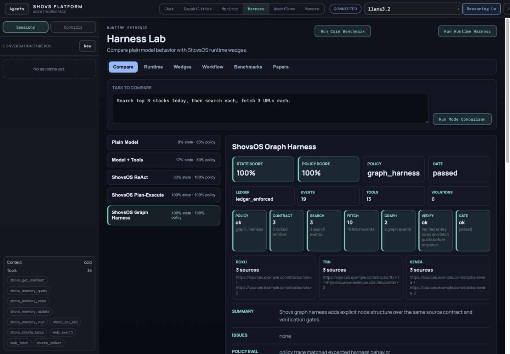
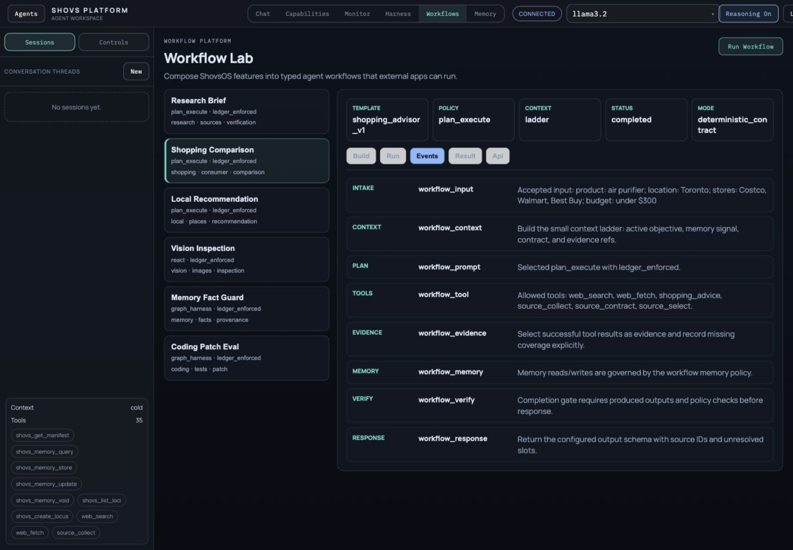
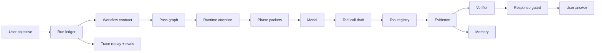
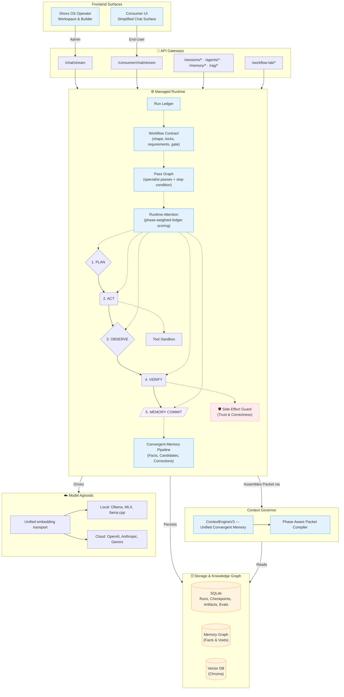

# Shovs LLM OS

A local-first research runtime for studying agents that plan, use tools, remember, verify, and explain what happened.

Shovs is not a finished product and not a broad benchmark claim. It is a working research codebase that explores whether structured runtime state can make agent behavior easier to inspect and test.

The core idea is simple:

> The model can generate language. The runtime should hold the state.

That means Shovs experiments with separating trusted facts from guesses, linking tool calls to tool results, checking whether work is actually done, and exposing traces, checkpoints, artifacts, memory state, and evals so a human can inspect the run.


---

## Credibility Path

If you are evaluating Shovs quickly, read these in order:

| File | Purpose |
| --- | --- |
| [extractions/shovs-harness-core](extractions/shovs-harness-core) | Small standalone harness extension with setup checks, a live demo app, and llama.cpp probe support. |
| [HARNESS.md](HARNESS.md) | Defines the agent harness in simple terms, with runtime diagrams. |
| [BENCHMARKS.md](BENCHMARKS.md) | Shows the deterministic benchmark suite and what each scenario checks. |
| [EVALS.md](EVALS.md) | Explains scenario-state evaluation and why final-answer-only judging is not enough. |
| [CLAIMS.md](CLAIMS.md) | Separates locally validated claims from active research and product work. |
| [RESULTS.md](RESULTS.md) | Records the latest local validation snapshot and live smoke checks. |

Core benchmark command:

```bash
venv/bin/python -m pytest tests/test_agent_harness_core_benchmarks.py -q
```

The example result shape is in [benchmarks/agent_harness_core](benchmarks/agent_harness_core).

The operator UI also includes a **Harness** workspace tab. It exposes the same research idea interactively:

- compare plain model, model plus tools, observed Shovs, and enforced Shovs modes
- inspect each wedge and its limitation
- run the deterministic Agent Harness Core benchmark from the browser
- see related research references beside the actual runtime features

The UI now also includes a **Workflows** workspace tab. This is the beginning of a product-facing platform layer over the same runtime pieces:

- choose a typed workflow such as Research Brief, Shopping Comparison, Local Recommendation, Memory Fact Guard, or Coding Patch Eval
- inspect the workflow steps, required inputs, allowed tools, memory policy, completion gates, and output schema
- run a deterministic contract-backed workflow preview
- run an optional live `RunEngine` workflow under the same API envelope
- inspect status events and the result contract
- copy the API request shape that another frontend app could use

The workflow layer is intentionally contract-first. It is not a free-form node canvas yet. Its current purpose is to make ShovsOS features composable and inspectable through stable workflow definitions, durable run records, status polling, event history, and result contracts.

## Current UI Test Run

These screenshots were captured from the local React frontend running against the local FastAPI backend. They are not benchmark claims; they show the operator surfaces used to inspect whether a run preserved entities, followed tool policy, gathered evidence, and completed the expected workflow.



The Harness Lab view compares a plain model path, a model-with-tools path, and Shovs runtime modes on the same source-collection task. The useful signal is not prettier prose. The useful signal is whether the run can prove its locked entities, search/fetch counts, policy gate, ledger mode, trace events, and unresolved issues.



The Workflow Lab view exposes ShovsOS features as typed workflows. In this run, the Shopping Comparison workflow shows the selected policy, context mode, completion status, and ordered events from intake through response.

---

## Why this exists

Most agent systems give the model a long transcript, a tool list, and a big prompt. That works until the run gets long, tool results get noisy, or the model forgets which facts are allowed to drive the next step.

Shovs takes a different approach. It treats language as input and output, but not as the only source of truth. A run is stored as structured state:

- the user's objective
- the current plan
- workflow contract, when the request has a recognizable work shape
- pass graph, which names the specialist passes needed for the workflow
- allowed tools
- tool calls and tool results
- evidence gathered so far
- memory writes
- verification results
- continuation state for unfinished work

Each phase gets a compiled packet built from that state. Planning sees the objective and constraints. Acting sees the next tool requirement. Observation sees tool results and missing slots. Verification checks claims against evidence. Memory commit only writes eligible facts.

Shovs also infers a workflow contract for recognizable task shapes, builds a pass graph of specialist roles, then computes a small runtime attention snapshot before packet compilation. This is not neural attention inside the model. It is deterministic scoring over ledger records so the runtime can show which objective, workflow contract, pass graph, plan step, tool result, evidence item, verification issue, or memory write is most relevant for the current phase.

Core research ideas make this different from a prompt wrapper:

| Idea | Plain meaning |
| --- | --- |
| **Run ledger** | Every important action in a run gets a durable record: plan, tool call, result, evidence, memory write, verification, and continuation state. |
| **Workflow contracts** | Recognizable tasks become explicit constraints: workflow shape, entity locks, evidence requirements, tool policy, completion gate, and continuation policy. |
| **Workflow Lab** | Product-facing workflow definitions expose inputs, steps, tools, memory policy, trace events, result schemas, and API contracts. |
| **Deterministic source compiler** | `source_collect` turns multi-source tasks into one inspectable contract, coverage report, fetch queue, and final-answer gate. |
| **Search query boundary** | The rich user objective stays in the ledger; `web_search.query` is compiled into a compact retrieval probe before execution. |
| **Pass framework** | Each workflow maps to specialist passes such as retrieval, reasoning, scoring, evaluation, summarization, and orchestration. |
| **Runtime attention** | The runtime scores ledger records by phase before building context, then records the weights for trace/UI inspection. |
| **Phase packets** | The model does not see one giant blob. It sees the right context for the current phase. |
| **Ledger-authority tools** | Managed deterministic tools should read prior successful ledger results by ID instead of trusting model-supplied payloads. |
| **Fact guard** | User-stated facts and corrections become structured memory. Guesses stay in a candidate lane until verified. |
| **Tool honesty** | The runtime has guards that can reject or warn on unsupported tool-success claims in tested paths. Write tools must verify expected paths. |
| **Scenario evals** | The system can judge the path taken, not only the final answer. If the agent searched the wrong ticker or fetched the wrong URL, the run can fail even if the response sounds plausible. |

---

## Agent Harness Core

The smallest testable Shovs wedge is the agent harness core:



This is the part being shaped toward possible reuse inside another agent system:

- use the ledger to hold task state
- use workflow contracts to preserve the structure of multi-step work
- use pass graphs to make specialist roles and stop conditions explicit
- use runtime attention to rank phase-relevant state before packet compilation
- use phase packets to reduce prompt drift
- use ledger-authority tool inputs so models cannot invent prior search/fetch payloads
- use evidence IDs to ground final answers
- use memory lanes to avoid stale facts
- use replay evals to catch wrong paths

---

## Architecture



### Runtime flow for one turn

```
user message
     │
     ▼
session_manager.create() ──── HOOK: session_started ────▶ subscribers
     │
     ▼
RunEngine.stream()
     │
     ├─ Load session + current facts
     ├─ Create canonical run ledger
     ├─ Analyze conversation tension
     ├─ Discover available skills          (run_engine/skill_loader.py)
     ├─ Classify code intent               (run_engine/code_intent.py)
     │
     ├─ PLANNING phase
     │     PacketBuildInputs → build_phase_packet()
     │     orchestrator.plan_with_context()
     │     ledger.set_plan(...)
     │     ──── HOOK: plan_generated ──▶ subscribers
     │
     ├─ Inject active skill into PacketBuildInputs.active_skill_context
     │
     ├─ ACTING phase (loop)
     │     For each tool turn:
     │       compile packet → actor selects tool
     │       parse hidden ToolCallDraft
     │         ──── HOOK: tool_selected ──▶ subscribers
     │       ToolRegistry executes (Docker sandbox for bash)
     │       ledger links tool_call_id → tool_result_id
     │       side_effect_guard verifies expected paths
     │         ──── HOOK: tool_completed ──▶ subscribers
     │         ──── HOOK: hard_failure   ──▶ if status=HARD_FAILURE
     │       ToolLoopGuard circuit-breaks repeat failures
     │
     ├─ OBSERVATION phase
     │     orchestrator decides continue / finalize
     │     deterministic workflow contracts may require more evidence
     │
     ├─ RESPONSE phase
     │     actor generates final answer (skill context REMOVED)
     │
     ├─ VERIFICATION phase
     │     check response against tool evidence
     │     reject if claims unsupported
     │     persist run evals where available
     │
     └─ MEMORY_COMMIT phase
           deterministic extraction → fact_guard → semantic graph
           compression-side facts → candidate signals if ungrounded
             ──── HOOK: memory_stored ──▶ per accepted fact
           ──── HOOK: run_complete   ──▶ subscribers
```

### Lifecycle hooks (`plugins/hook_registry.py`)

Subscribe to runtime events from any plugin:

```python
from plugins.hook_registry import hooks, HookEvent

@hooks.on("memory_stored")
async def log_fact(event: HookEvent) -> None:
    print(f"Stored {event.data['subject']} {event.data['predicate']} {event.data['object']}")
```

| Event             | Fires when                         | Payload keys                                 |
| ----------------- | ---------------------------------- | -------------------------------------------- |
| `session_started` | `session_manager.create()` returns | `agent_id, model, owner_id, [plane]`         |
| `plan_generated`  | planner returns structured plan    | `route, skill, tools, confidence, strategy`  |
| `tool_selected`   | actor chose a tool                 | `tool_name, arguments_preview`               |
| `tool_completed`  | tool execution finished            | `tool_name, success, turn`                   |
| `hard_failure`    | tool returned HARD_FAILURE         | `tool_name, turn, preview`                   |
| `memory_stored`   | fact accepted into semantic graph  | `subject, predicate, object, turn, owner_id` |
| `run_complete`    | run finished                       | `run_id, route, tool_count, success`         |

Handlers run concurrently via `asyncio.gather`; exceptions are logged, never raised into the engine loop.

---

## Quick start

```bash
# One-shot install (idempotent — safe to re-run)
./scripts/install.sh

# Verify the install
python3 scripts/doctor.py

# Run Shovs Platform (operator workspace, no Docker required)
npm run dev
# → backend + frontend_shovs; Docker-backed bash returns a typed denial

# Run with Docker services enabled
npm run dev:shovs:docker
# → starts SearXNG + agent-sandbox, then backend + frontend_shovs

# Run Consumer plane
npm run dev:consumer

# Backend only
npm run dev:backend
# → http://localhost:8000  ·  /docs for OpenAPI
```

`scripts/doctor.py` checks: Python ≥3.10, provider API keys, Ollama reachability, optional Docker/SearXNG/llama.cpp services, writable DB/chroma/logs paths, LLM adapters import, skill loader works (≥1 skill), unified context engine has its budget knobs.

The full interactive setup (Docker services, embed model selection) is in [setup-linux-mac.sh](setup-linux-mac.sh) and [setup-windows.ps1](setup-windows.ps1).

### Running without Docker

Docker is useful for the sandboxed `bash` tool and local SearXNG search, but the main app should not require Docker just to open and test agents.

Use:

```bash
npm run dev
```

This starts the backend from `./venv/bin/python` when the project venv exists, disables MCP for the lightweight local run, and sets `DOCKER_DISABLED=true`. The app still boots; Docker-only execution returns a clear denial instead of crashing. `/runtime/health` reports Docker, SearXNG, and llama.cpp as optional service statuses so the frontend can show what is missing.

If port `8000` is already occupied, run the backend on another port:

```bash
BACKEND_PORT=8010 npm run dev:backend:local
```

---

## Configure providers

Pick one (or several — the runtime supports per-agent provider selection):

```env
# Local (no API key required)
LLM_PROVIDER=ollama
OLLAMA_BASE_URL=http://localhost:11434
DEFAULT_MODEL=llama3.2

LLM_PROVIDER=lmstudio
LMSTUDIO_BASE_URL=http://127.0.0.1:1234/v1
LMSTUDIO_API_KEY=lm-studio
DEFAULT_MODEL=qwen2.5-coder-3b-instruct-mlx

LLM_PROVIDER=llamacpp
LLAMACPP_BASE_URL=http://127.0.0.1:8080/v1
LLAMACPP_DEFAULT_MODEL=local-model

# Cloud
OPENAI_API_KEY=sk-...
ANTHROPIC_API_KEY=sk-ant-...
GROQ_API_KEY=gsk_...
GEMINI_API_KEY=AIza...
NVIDIA_API_KEY=nvapi-...

# Optional market data
ALPHA_VANTAGE_API_KEY=...

# Optional image generation
IMAGE_GENERATION_MODEL=gpt-image-1
```

Embedding transport auto-detects `/api/embed` (current Ollama) and `/api/embeddings` (legacy); LM Studio / llama.cpp / OpenAI-compatible servers use `/v1/embeddings`.

Image generation is exposed both as an agent tool (`image_generate`) and as `POST /images/generate`. Generated files are saved under the sandbox and served from `/sandbox/generated/images/...`. If `OPENAI_API_KEY` is missing, the tool returns a typed failure instead of pretending an image was created.

For llama.cpp on Apple Silicon:

```bash
# install via Homebrew, then start a local OpenAI-compatible server
llama-server -m /absolute/path/to/model.gguf --host 127.0.0.1 --port 8080

export LLM_PROVIDER=llamacpp
export LLAMACPP_BASE_URL=http://127.0.0.1:8080/v1
export LLAMACPP_DEFAULT_MODEL=local-model
npm run dev:local
```

If port `8080` is already used, start `llama-server` on another port and set `LLAMACPP_BASE_URL` to match.

---

## Repository map

```
shovsOS/
├── api/                    FastAPI routes  (main.py, consumer_routes.py, owner.py, ...)
├── engine/                 Context, schema, compiler, governor, fact guard, side-effect guard
│   ├── context_engine_v3.py    Unified convergent memory engine
│   ├── context_engine_v2.py    Convergent ranking + resonance
│   ├── context_engine.py       Linear bullet compression (V1, internal)
│   ├── context_governor.py     Always returns V3 — single surface
│   ├── context_schema.py       ContextItem, ContextKind, ContextPhase
│   ├── context_compiler.py     compile_context_items() — phase-aware assembly
│   ├── side_effect_guard.py    HARD_FAILURE / unsupported-claim detection
│   ├── conversation_tension.py Cross-turn contradiction detection
│   └── deterministic_facts.py  User-stated fact extraction
│
├── run_engine/             Managed runtime
│   ├── engine.py               Main loop (planning → acting → observe → verify → memory_commit)
│   ├── ledger.py               Canonical run ledger records
│   ├── scenario_eval.py        Scenario-state evaluation for workflow correctness
│   ├── context_packets.py      PacketBuildInputs → build_phase_packet()
│   ├── memory_pipeline.py      Grounding, compression normalization, fact commit
│   ├── skill_loader.py         SKILL.md discovery + loading
│   ├── code_intent.py          Pre-planning code intent classifier
│   └── tool_selection.py       Actor request shaping, tool-call parsing
│
├── orchestration/          Orchestrator, run store, session manager, agent profiles
├── memory/                 Semantic graph (SQLite), vector engine (Chroma), session RAG
├── plugins/                Tool registry + tools + hook registry
│   ├── tool_registry.py        Tool dataclass, brace-counting tool-call detector
│   ├── tools.py                Built-in tools (web_search, file_create, bash, query_memory, ...)
│   ├── tools_web.py            Canonical web search/fetch
│   ├── shovs_meta_gateway.py   External-agent gateway (memory palace tools)
│   └── hook_registry.py        Lifecycle event pub/sub (7 events)
│
├── llm/                    Provider adapters (5: Ollama, OpenAI, Anthropic, Groq, Gemini)
├── shovs_memory/           Installable memory wedge (uses orchestration + memory)
├── frontend_shovs/         Operator workspace (React + Vite)
├── frontend_consumer/      Consumer plane
├── .agent/skills/          9 platform skills (agent_platform_backend, debugging, frontend_design, ...)
├── scripts/                install.sh, doctor.py
└── documentation/public/   VISION, DEVELOPER_GUIDE, FEATURES_AND_ROADMAP, SETUP, SHOVS_MEMORY
```

---

## What `shovs-memory` is

The smallest adoptable surface of this repo. Use it when you want deterministic fact writes, correction-aware temporal memory, candidate demotion, conflict traces, and inspectable memory state without adopting the full agent runtime.

```python
from orchestration.session_manager import SessionManager
from shovs_memory import ShovsMemory

sessions = SessionManager()
memory = ShovsMemory(session_id="user-123", owner_id="owner-123", session_manager=sessions)

memory.apply_user_message("My name is Shovon. I use Cursor.", turn=1)
memory.apply_user_message("Actually, I moved to Berlin.", turn=2)

print(memory.current_facts())   # latest fact for each predicate
print(memory.fact_timeline())   # history with voids
print(memory.inspect())         # full memory state snapshot
```

Use the full runtime (`RunEngine`) when you also want loop orchestration, tool execution, run ledgers, traces, checkpoints, artifacts, scenario evals, and verified responses.

---

## Skills

Drop a `SKILL.md` under `.agent/skills/{name}/`:

```markdown
---
name: debugging
description: Use when the user reports a bug, crash, traceback, or regression.
triggers: bug, crash, traceback, regression, broken, exception, error, fix, debug
eligibility: auto
---

# Debugging skill

Approach:

1. Reproduce the failure deterministically.
2. Bisect: change one thing at a time.
3. ...
```

The loader parses the simple frontmatter (single-line `triggers:` is comma-separated). Skills are surfaced into PLANNING and ACTING packets only — never RESPONSE or MEMORY_COMMIT — and carry `trace_id="skill_loader:{name}"` for full provenance.

Built-in skills: `agent_platform_backend`, `code_review`, `debugging`, `frontend_design`, `memory_palace`, `pdf`, `shell_workflow`, `testing`, `web_research`.

---

## Tool contract & side-effect honesty

Every tool returns a JSON payload with `success`, `status`, and (when applicable) `verification`:

```json
{
  "type": "bash_result",
  "success": true,
  "status": "SUCCESS",
  "command": "...",
  "output": "...",
  "verification": {
    "expected_paths": ["/sandbox/report.html"],
    "missing_paths": []
  }
}
```

When `bash` or `file_create` is called and the expected write target does not exist post-execution, the tool returns `status: "HARD_FAILURE"`. The `side_effect_guard` then blocks the response from claiming success, and the runtime emits the `hard_failure` lifecycle hook.

Adding a tool:

```python
from plugins.tool_registry import Tool, registry

async def _my_tool(query: str) -> str:
    return f"result: {query}"

registry.register(Tool(
    name="my_tool",
    description="One sentence: what it does and when to use it.",
    parameters={
        "type": "object",
        "properties": {"query": {"type": "string"}},
        "required": ["query"],
    },
    handler=_my_tool,
    tags=["category"],
))
```

Add it to `ALL_TOOLS` in [plugins/tools.py](plugins/tools.py); registration runs at API startup.

---

## Why small models matter here

Runtime discipline raises the floor for small local models and the ceiling for frontier models. Phase-specific context, model-aware budget shaping (`small_local`, `tool_native_local`, `local_standard`, `frontier_native`, `frontier_standard`), candidate-vs-truth separation, and evidence cleanup reduce the noise that smaller models cannot recover from.

If a small local model can stay coherent across multi-tool runs, a frontier model becomes easier to supervise, debug, and trust.

---

## Public docs

- [SETUP](documentation/public/SETUP.md) — environment, providers, troubleshooting
- [DEVELOPER_GUIDE](documentation/public/DEVELOPER_GUIDE.md) — engineering reference
- [VISION](documentation/public/VISION.md) — thesis, claims, what makes Shovs different
- [FEATURES_AND_ROADMAP](documentation/public/FEATURES_AND_ROADMAP.md) — what ships, what's next
- [SHOVS_MEMORY](documentation/public/SHOVS_MEMORY.md) — memory wedge reference
- [ARCHITECTURE](ARCHITECTURE.md) — runtime + storage topology
- [ROADMAP](ROADMAP.md) — convergence phases
- [CONTRIBUTING](CONTRIBUTING.md) · [CODE_OF_CONDUCT](CODE_OF_CONDUCT.md) · [SECURITY](SECURITY.md) · [GOVERNANCE](GOVERNANCE.md) · [SUPPORT](SUPPORT.md)

---

## License

MIT
