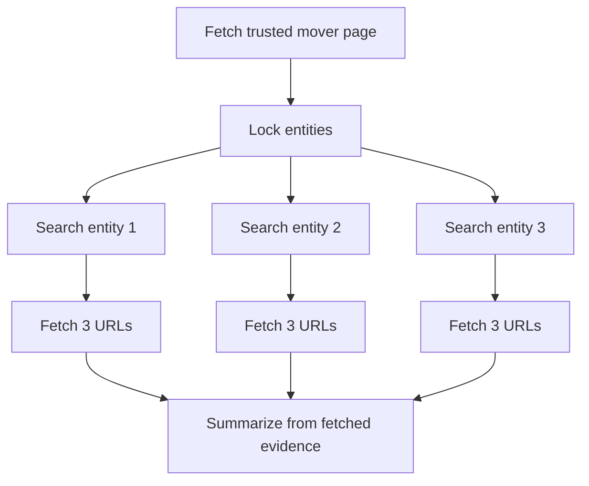

# Source Collection

Problem: the agent finds the right entities, then searches for different entities later.

Example:

```text
Find the top 3 gainers.
For each ticker, search ticker-specific news.
Fetch exactly 3 URLs per ticker.
```

Correct workflow:



The source contract keeps the locked entities and URL quota visible to the runtime. The eval checks the trace, not just the final answer.

